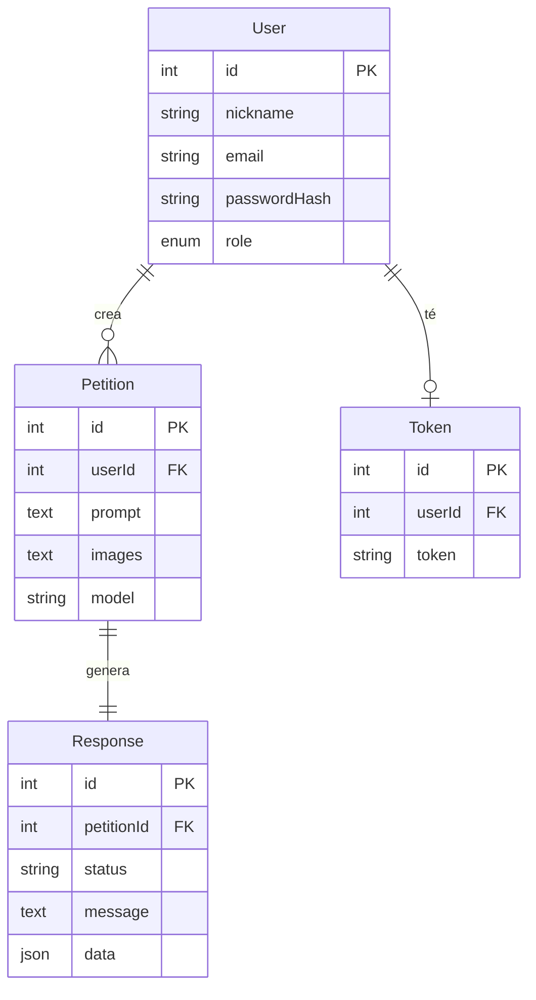

```mermaid
erDiagram
    User ||--o{ Petition : "crea"
    Petition ||--|| Response : "genera"
    User ||--o| Token : "té"

    User {
        int id PK
        string nickname
        string email
        string passwordHash
        enum role
    }

    Token {
        int id PK
        int userId FK
        string token
    }

    Petition {
        int id PK
        int userId FK
        text prompt
        text images
        string model
    }

    Response {
        int id PK
        int petitionId FK
        string status
        text message
        json data
    }

```